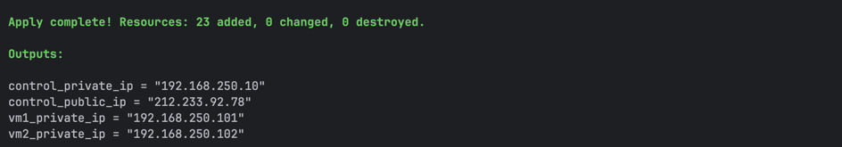
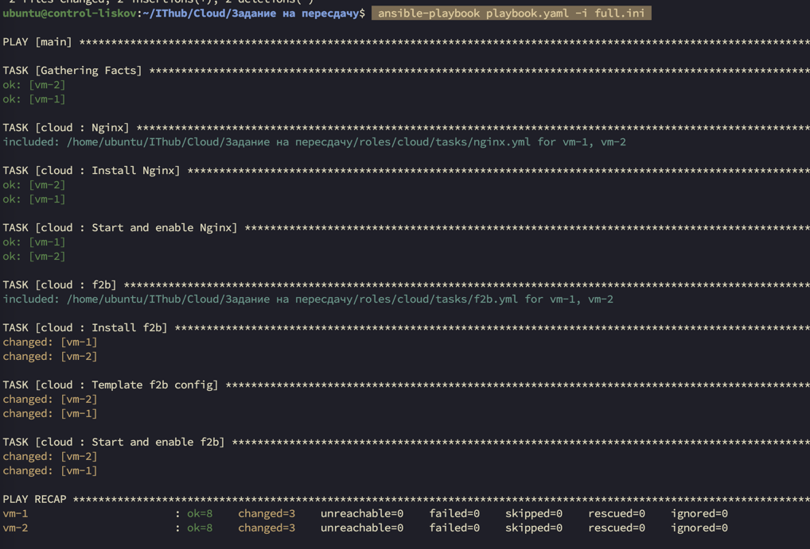

Развернуть инфраструктуру при помощи main.tf / variables.tf / vkcs_provider.tf
```
terraform apply  
```



Далее на control-node прокидываем ключ, который используем, для ssh доступа

После клонируем git репозиторий и прокатываем роль

```
 ansible-playbook playbook.yaml -i full.ini
```

